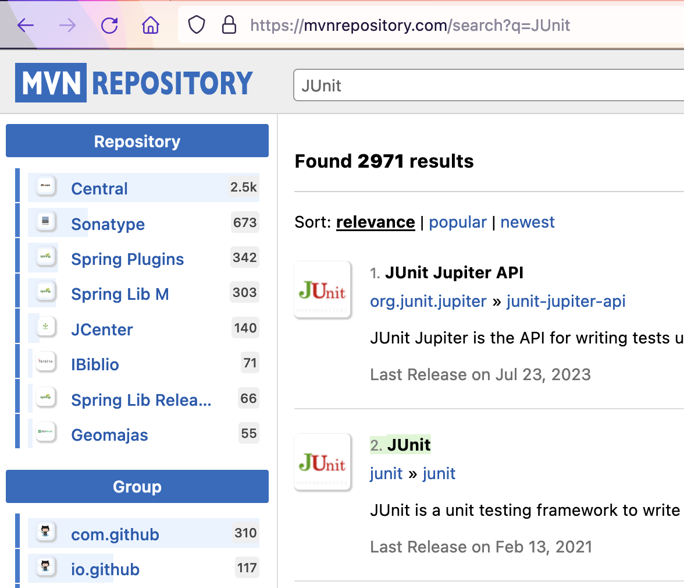

# Taller de Pruebas Unitarias - Desarrollo dirigido por pruebas (TDD)

Este taller adapta el enfoque clásico de **TDD** (Red → Green → Refactor) a una **Arquitectura Limpia (Clean Architecture)**. El objetivo es que las **pruebas unitarias** garanticen la calidad del **dominio** sin acoplarse a frameworks o infraestructura.

---

## 🎯 Objetivos del taller

- Diseñar pruebas unitarias que ejerciten **reglas de negocio** (dominio) de forma **aislada**.
- Aplicar TDD: **primero la prueba**, luego la implementación mínima, y **refactor** continuo.
- Mantener **dependencias hacia adentro**: el dominio **no** conoce bases de datos, HTTP ni librerías externas.
- Escribir pruebas siguiendo el patrón **AAA (Arrange – Act – Assert)** para mejorar legibilidad y mantenibilidad.
- Definir **clases de equivalencia y valores límite** que permitan cubrir escenarios válidos, inválidos y bordes con un número mínimo de pruebas.
- Expresar pruebas con **BDD (Given–When–Then)** para alinear el código con el lenguaje de negocio y asegurar trazabilidad entre requisitos y validación.

---

## 📑 Índice

- [Pruebas unitarias básicas](#pruebas-unitarias-básicas)
- [Ejercicio](#ejercicio-registraduría)
- [TDD (Red → Green → Refactor)](#tdd-paso-a-paso-red--green--refactor)
- [Patrón AAA (Arrange – Act – Assert)](#patrón-aaa-arrange--act--assert)
- [Ejecutar pruebas](#ejecutar-las-pruebas)
- [Clases de equivalencia](#clases-de-equivalencia)
- [Guía avanzada de Pruebas Unitarias](#guía-avanzada-de-pruebas-unitarias)
- [Para entregar](#para-entregar-con-este-taller)
- [Resumen del Taller de TDD](#hagamos-un-resumen)
- [Conclusión](#conclusión)
- [Recursos recomendados](#recursos-recomendados)

---

## PRUEBAS UNITARIAS BÁSICAS

---

### CREAR UN PROYECTO CON MAVEN

En el directorio de trabajo ejecutar el comando necesario para crear/generar un proyecto maven basado en un arquetipo:

```yml
Grupo (groupId): edu.unisabana.tyvs
Artefacto (artifactId): pruebasunitarias
Paquete (package): edu.unisabana.tyvs.tdd
archetypeArtifactId: maven-archetype-quickstart
```

🎓 Si necesitas más ayuda con la creación de proyectos en Maven, revisa el [**Taller de Nivelación**](https://github.com/CesarAVegaF312/DYAS-Taller_nivelacion).

---

### ACTUALIZAR Y CREAR DEPENDENCIAS EN EL PROYECTO

Busque en internet el repositorio central de ["maven"](https://mvnrepository.com/).

Busque el artefacto JUnit y entre a la versión más nueva.



#### ⚠️ Nota sobre ubicación de archivos

Ingresar directamente a ["2. Junit"](https://mvnrepository.com/artifact/junit/junit).

Ingrese a la pestaña de Maven y haga click en el texto de la dependencia para copiarlo al portapapeles.

Edite el archivo `pom.xml` y realice las siguientes actualizaciones:

- Agregue/Reemplace la dependencia copiada a la sección de dependencias.
- Cambie la versión del compilador de Java a la versión 8 (o el de su computador), agregando la sección `properties` antes de la sección de dependencias:

---

### Dependencias mínimas (`pom.xml`)

```xml
  <properties>
    <project.build.sourceEncoding>UTF-8</project.build.sourceEncoding>
    <maven.compiler.source>1.8</maven.compiler.source>
    <maven.compiler.target>1.8</maven.compiler.target>
  </properties>

  <dependencies>
    <!-- JUnit 4 -->
    <dependency>
      <groupId>junit</groupId>
      <artifactId>junit</artifactId>
      <version>4.13.2</version>
      <scope>test</scope>
    </dependency>
  </dependencies>

  <build>
    <plugins>
      <plugin>
        <groupId>org.apache.maven.plugins</groupId>
        <artifactId>maven-surefire-plugin</artifactId>
        <version>3.2.5</version>
        <configuration>
          <useModulePath>false</useModulePath>
        </configuration>
      </plugin>
    </plugins>
  </build>
```

---

### COMPILAR Y EJECUTAR

Ejecute los comandos de Maven,

```bash
mvn clean package
```

para compilar el proyecto y verificar que el proyecto se creó correctamente y los cambios realizados al archivo pom no generan inconvenientes.

Ejecute el comando para ejecutar las pruebas unitarias de un proyecto desde Maven y ejecútelo sobre el proyecto.

```bash
mvn clean test
```

 Se debe ejecutar la clase `AppTest` con resultado exitoso.

---

## EJERCICIO “REGISTRADURÍA”

Se va a crear un proyecto base siguiendo la estructura de **Arquitectura Limpia (Clean Architecture)** para un cliente en la registraduría, en el cual se registrarán personas con intención de votar para las próximas elecciones y se generarán los certificados electorales de aquellas personas cuyo voto sea válido.

Se usará la clase *Person* que se describe más adelante. El servicio de la registraduría permitirá registrar personas que sean votantes.

### REQUERIMIENTOS

- Solo se registrarán votantes válidos.
- Solo se permite una inscripción por número de documento.

---

### HACER EL ESQUELETO DE LA APLICACION

---

### Estructura propuesta (monomódulo por paquetes)

```gherkin
src/
 ├─ main/java/edu/unisabana/tyvs/
 │   ├─ domain/
 │   │   ├─ model/              # Person, Gender, RegisterResult
 │   │   └─ service/            # Registry
 └─ test/java/edu/unisabana/tyvs/
     ├─ domain/
     │   └─ service/            # RegistryTest
```

> También puedes llevar esto a **multi-módulo Maven** más estricto más adelante. Para TDD, esta versión por paquetes es suficiente y simple.

---

#### Dominio: modelos

Cree el archivo `RegisterResult.java` en el directorio `edu.unisabana.tyvs.domain.model` con la enumeración:

```java
package edu.unisabana.tyvs.domain.model;
public enum RegisterResult { VALID, DUPLICATED, INVALID }
```

Cree el archivo `Gender.java` en el paquete `edu.unisabana.tyvs.domain.model` con la enumeración:

```java
package edu.unisabana.tyvs.domain.model;
public enum Gender { MALE, FEMALE, UNIDENTIFIED }
```

Cree el archivo `Person.java` en el paquete `edu.unisabana.tyvs.domain.model` con el siguiente contenido:

```java
package edu.unisabana.tyvs.domain.model;

public class Person {
    private final String name;
    private final int id;
    private final int age;
    private final Gender gender;
    private final boolean alive;

    public Person(String name, int id, int age, Gender gender, boolean alive) {
        this.name = name; this.id = id; this.age = age; this.gender = gender; this.alive = alive;
    }
    public String getName() { return name; }
    public int getId() { return id; }
    public int getAge() { return age; }
    public Gender getGender() { return gender; }
    public boolean isAlive() { return alive; }
}
```

---

#### Dominio: caso de uso (Servicio)

Cree el archivo `Registry.java` en el directorio `edu.unisabana.tyvs.domain.service` con el método `registerVoter`:

```java
package edu.unisabana.tyvs.domain.service;

import edu.unisabana.tyvs.domain.model.*;

public class Registry {

    public RegisterResult registerVoter(Person p) {
        // TODO Validate person and return real result.
        return RegisterResult.VALID;
    }
}
```

---

## TDD Paso a Paso (Red → Green → Refactor)

El ciclo TDD: Red → Green → Refactor es la práctica central de Desarrollo Guiado por Pruebas (Test-Driven Development) y consiste en tres pasos cortos y repetitivos:

### 1. RED (Rojo)

- Escribes una prueba unitaria nueva que describe el comportamiento que deseas.
- Como aún no has implementado el código (o la lógica está incompleta), la prueba falla.

### 2. GREEN (Verde)

- Escribes la implementación mínima para que la prueba pase.
- No importa si el código no es elegante todavía, lo importante es que sea funcional.

### 3. REFACTOR (Refactorizar)

- Una vez todas las pruebas están en verde, mejoras el código:
  - Limpias duplicación.
  - Renombras variables o métodos.
  - Ordenas condiciones.
  - Extraes constantes.
- Lo clave: no rompes pruebas existentes.

Todos los archivos relacionados específicamente con los temas de pruebas deben ir bajo la carpeta `test`.

Adicional a esta practica de creacion de pruebas vamos a seguir el diseño de pruebas patrón **AAA (Arrange – Act – Assert)**

## Patrón AAA (Arrange – Act – Assert)

En el diseño de pruebas unitarias se recomienda estructurar cada método de prueba siguiendo el patrón AAA:

### Arrange (Preparar)

- Se configuran los datos, objetos y estado inicial necesarios para la prueba.

### Act (Actuar)

- Se ejecuta la acción que queremos probar.

### Assert (Afirmar)

- Se verifican los resultados obtenidos frente a lo esperado.

#### ⚠️ Nota importante

✅ Este patrón mejora la legibilidad y mantenibilidad de las pruebas porque:

- Hace evidente qué se está preparando, qué se está probando y qué se está validando.
- Facilita que otros desarrolladores entiendan rápidamente el propósito de cada prueba.
- Evita que las pruebas se conviertan en “cajas negras” difíciles de interpretar.

Empecemos ...

---

## EJECUTAR LAS PRUEBAS

---

### 1. RED: primera prueba (camino feliz)

Bajo la carpeta de pruebas, cree la clase `RegistryTest.java` en el directorio `edu.unisabana.tyvs.domain.service`:

```java
package edu.unisabana.tyvs.domain.service;

import edu.unisabana.tyvs.domain.model.*;
import org.junit.Assert;
import org.junit.Test;

public class RegistryTest {

    @Test
    public void shouldRegisterValidPerson() {
        // Arrange: preparar los datos y el objeto a probar
        Registry registry = new Registry();
        Person person = new Person("Ana", 1, 30, Gender.FEMALE, true);

        // Act: ejecutar la acción que queremos probar
        RegisterResult result = registry.registerVoter(person);

        // Assert: verificar el resultado esperado
        Assert.assertEquals(RegisterResult.VALID, result);
    }
}


```

### 2. GREEN: implementación mínima para segunda prueba

Ya devuelve `VALID`, la prueba pasa.

---

#### ⚠️ Nota importante sobre ubicación del `pom.xml`

Recuerde ejecutar todos los comandos Maven desde la carpeta **raíz del proyecto**, donde se encuentra el archivo `pom.xml`.

---

Para correr las pruebas utilice:

```sh
mvn clean compile
```

También puede utilizar:

```sh
mvn clean test
```

---

Revise cuál es la diferencia.
Tip: [Maven Lifecycle Phases](https://www.devopsschool.com/blog/maven-tutorials-maven-lifecycle-phases-goal).

---

Pero hagamos otra prueba ...

---

### 1. RED: persona muerta → DEAD

```java

    @Test
    public void shouldRejectDeadPerson() {
        // Arrange: preparar los datos y el objeto a probar
        Registry registry = new Registry();
        Person dead = new Person("Carlos", 2, 40, Gender.MALE, false);

        // Act: ejecutar la acción que queremos probar
        RegisterResult result = registry.registerVoter(dead);

        // Assert: verificar el resultado esperado
        Assert.assertEquals(RegisterResult.DEAD, result);
    }

```

### 2. GREEN: implementación mínima

Agregue este código a su clase `Registry.java` para ir complementando y haciendo mas robusta su clase.

```java

if (!p.isAlive()) return RegisterResult.DEAD;

```

### 3. Refactor

Refactorizando el código.

```java
package edu.unisabana.tyvs.domain.service;

import edu.unisabana.tyvs.domain.model.Person;
import edu.unisabana.tyvs.domain.model.RegisterResult;

public class Registry {

    public RegisterResult registerVoter(Person p) {
        if (p == null) {
            return RegisterResult.INVALID; // regla defensiva
        }
        if (!p.isAlive()) {
            return RegisterResult.DEAD;
        }
        // implementación mínima para pasar las pruebas actuales
        return RegisterResult.VALID;
    }
}
```

y

```java
package edu.unisabana.tyvs.domain.model;

public enum RegisterResult {
    VALID, DUPLICATED, INVALID, DEAD
}
```

Ejecutar y validar nuevamente el resultado.

---

## CLASES DE EQUIVALENCIA

Antes de escribir pruebas conviene particionar el dominio de entrada en clases de [equivalencia](https://prezi.com/view/LyUYlz5nx2UmnKVMgSve/?referral_token=inUc7klnB3FN): grupos de valores que el sistema trata de la misma forma. Probar un representante por clase suele ser suficiente, y se refuerza con valores límite (los bordes entre clases), donde suelen aparecer errores. Piense en los casos de equivalencia que se pueden generar del ejercicio para la registraduría dadas las condiciones.

Para `registerVoter(Person)` el espacio de entradas se define por los atributos del dominio (Definición de datos):

- Edad
  - Clase inválida: `edad < 0` → `INVALID_AGE` (límite: `-1`, borde inferior).
  - Clase “menor”: `0 ≤ edad < 18` → `UNDERAGE` (límites: `17` y `18`).
  - Clase válida: `18 ≤ edad ≤ 120` → contribuye a `VALID` si demás reglas pasan (límites: `18`, `120`).
  - Clase inválida: `edad > 120` → `INVALID_AGE` (límite: `121`).

- Estado de vida
  - `alive = false` → `DEAD` (independiente de la edad).
  - `alive = true` → continúa evaluación de edad/duplicados.

- Identificador (unicidad)
  - Clase inválida de formato (opcional según tu enum): `id ≤ 0` → `INVALID`/`INVALID_ID`.
  - Clase “duplicado”: mismo `id` ya registrado → `DUPLICATED`.
  - Clase “único”: `id` no registrado → continúa evaluación.

- Nulidad
  - `person == null` → `INVALID` (validación defensiva).

---

## Guía avanzada de Pruebas Unitarias

Las pruebas unitarias son la base de un plan de pruebas exhaustivo. Para alinearnos con las buenas prácticas internacionales y los resultados de aprendizaje del curso, además de implementar las pruebas básicas, se deben considerar los siguientes aspectos:

---

### 1. Planificación de las pruebas

Define una **matriz de clases de equivalencia y valores límite** para `registerVoter`.

Ejemplo:

| Caso | Entrada | Resultado esperado |
|------|---------|---------------------|
| Persona viva, edad 30, id único | (edad=30, vivo=true, id=1) | VALID |
| Persona muerta | (edad=45, vivo=false) | DEAD |
| Edad 17 | (edad=17, vivo=true) | UNDERAGE |
| Edad -1 | (edad=-1, vivo=true) | INVALID_AGE |
| Persona duplicada | (edad=25, id=777 dos veces) | DUPLICATED |

---

### 2. Cobertura de código

Agrega **JaCoCo** para medir cobertura.
Este plugin debe incluirse dentro de la sección `<build><plugins> ... </plugins></build>` del archivo `pom.xml`.

```xml
    <!-- (Opcional pero recomendado) JaCoCo para cobertura -->
    <build>
      <plugins>
        <plugin>
          <groupId>org.jacoco</groupId>
          <artifactId>jacoco-maven-plugin</artifactId>
          <version>0.8.12</version>
          <executions>
            <execution>
              <id>prepare-agent</id>
              <goals>
                <goal>prepare-agent</goal>
              </goals>
            </execution>
            <execution>
              <id>report</id>
              <phase>verify</phase>
              <goals>
                <goal>report</goal>
              </goals>
            </execution>
          </executions>
        </plugin>
      </plugins>
    </build>
```

Ejecuta:

```sh
mvn clean test
mvn jacoco:report
```

Revisa el archivo `target/site/jacoco/index.html`.

---

## 3. Robustez de las pruebas

La escritura de pruebas con **BDD (Behavior-Driven Development)** busca que los casos de prueba se expresen en un lenguaje cercano al negocio, entendible tanto para desarrolladores como para usuarios y analistas. A diferencia de las pruebas unitarias tradicionales, que se centran en métodos o clases, en BDD se describe el **comportamiento esperado del sistema** usando una narrativa estructurada en términos de Given–When–Then (Dado–Cuando–Entonces). Esto facilita la comunicación entre los diferentes actores de un proyecto, asegura que las pruebas estén alineadas con los requisitos funcionales y promueve que el código se construya a partir de la especificación del comportamiento deseado. En el marco de esta asignatura, BDD aporta claridad al proceso de validación, ya que conecta directamente las reglas de negocio con la verificación automatizada, fortaleciendo la robustez y la trazabilidad de las pruebas.

Ejemplo:

```gherkin
Escenario: Rechazar persona menor de edad
  Dado (Given) que existe una persona viva de 17 años
  Cuando (When) intento registrarla
  Entonces (Then) el resultado debe ser UNDERAGE
```

---

## 4. Clases de equivalencia y escenarios BDD

La siguiente tabla combina los nombres de los tests unitarios (estilo técnico en JUnit) con su respectiva especificación en **BDD (Given–When–Then)**, de manera que se mantenga trazabilidad entre las reglas de negocio y las pruebas.

| Nombre del test (JUnit) | Escenario BDD (Given–When–Then) |
|--------------------------|----------------------------------|
| **shouldReturnInvalidWhenPersonIsNull** | **Given** la persona es `null`; **When** intento registrarla; **Then** el resultado debe ser `INVALID` |
| **shouldRejectWhenIdIsZeroOrNegative** | **Given** la persona tiene `id = 0` (o `id = -5`), edad 25 y está viva; **When** intento registrarla; **Then** el resultado debe ser `INVALID` |
| **shouldRejectUnderageAt17** | **Given** la persona tiene 17 años, está viva y su id es válido; **When** intento registrarla; **Then** el resultado debe ser `UNDERAGE` |
| **shouldAcceptAdultAt18** | **Given** la persona tiene 18 años, está viva y su id es válido; **When** intento registrarla; **Then** el resultado debe ser `VALID` |
| **shouldAcceptMaxAge120** | **Given** la persona tiene 120 años, está viva y su id es válido; **When** intento registrarla; **Then** el resultado debe ser `VALID` |
| **shouldRejectInvalidAgeOver120** | **Given** la persona tiene 121 años, está viva y su id es válido; **When** intento registrarla; **Then** el resultado debe ser `INVALID_AGE` |

> **Regla**: todas las pruebas unitarias se enfocan en **dominio**.

---

## 5. Gestión de defectos

Crea un archivo `defectos.md` para documentar fallos:

```gherkin
### Defecto 01
- Caso: edad -1
- Esperado: INVALID_AGE
- Obtenido: VALID
- Causa probable: falta de validación en límites
- Estado: Abierto
```

---

## 6. Automatización e integración (Opcional)

- Ejecuta las pruebas unitarias en cada commit con CI (GitHub Actions, Jenkins, GitLab CI).
- Rechaza merges si `mvn test` falla.

🎓 Esta guía presenta el proceso para la creación y configuración de flujos de Integración Continua (CI) utilizando GitHub Actions.
Puedes consultarla en el siguiente enlace: [**Taller de Integración Continua en GitHub**](https://github.com/CesarAVegaF312/DAYS-Integracion_continua/tree/main/github).

---

## PARA ENTREGAR CON ESTE TALLER

### 1) Repositorio

- **Repositorio Git** con el proyecto y **URL de acceso público** (o invitación).
- Archivo **`.gitignore`** (excluir `target/`, archivos del IDE, etc.).
- Archivo **`integrantes.txt`** o sección en el README con nombres completos.
- **Rama principal compilable**: `mvn clean test` sin pasos manuales adicionales.

### 2) Documentación en Wiki (obligatoria)

> Toda la documentación del taller se entrega en el **Wiki del mismo repositorio**.
> No es necesario PDF. El Wiki es el documento oficial de entrega.

Estructura mínima sugerida del Wiki:

- **Inicio**: resumen del dominio, alcance del taller y equipo.
- **TDD (Red → Green → Refactor)**: al menos 3 iteraciones mas con breve “historia TDD”.
- **Patrón AAA**: ejemplo de test con Arrange–Act–Assert y pautas usadas.
- **Clases de Equivalencia y Valores Límite**: tabla + justificación de los bordes.
- **BDD (Given–When–Then)**: escenarios clave.
- **Resultados**: cobertura (capturas JaCoCo) y conclusiones técnicas.

Incluye **enlaces al código** (clases y tests) dentro de cada sección del Wiki.

### 3) Pruebas unitarias (dominio puro)

- Al menos **5 clases de equivalencia** cubiertas y **escenarios BDD** correspondientes.
- Todas las pruebas escritas con **AAA (Arrange–Act–Assert)**.
- Nomenclatura clara de métodos de prueba (`should…When…()`).
- Tests en `src/test/java` **mismo paquete** que la clase probada.

### 4) Cobertura (JaCoCo)

- Reporte **JaCoCo** generado en `target/site/jacoco/index.html`.
- **≥ 80%** cobertura **global** (y ≥ 80% en el paquete de dominio).
- Adjuntar **capturas** en el Wiki y comentar brevemente qué líneas quedaron sin cubrir y por qué.

### 5) Evidencia de TDD

- Sección **“Historia TDD”** en el Wiki con 3+ ciclos:
  - **Rojo**: prueba nueva que falla.
  - **Verde**: cambio mínimo para que pase.
  - **Refactor**: mejora manteniendo verde.
- (Opcional) Mensajes de commit ilustrativos:
  - `test: add dead person rule (RED)`
  - `feat: minimal check alive (GREEN)`
  - `refactor: extract constants (REFACTOR)`

### 6) Matriz de pruebas

- Tabla con **clases de equivalencia** y **valores límite**:
  - **Entrada representativa**, **Resultado esperado**, **test que lo cubre** (nombre del método).

### 7) Gestión de defectos

- Archivo **`defectos.md`**:
  - Al menos **1 defecto** (real o simulado): caso, esperado vs. obtenido, causa probable, estado (Abierto/Cerrado).

### 8) Calidad del código

- Constantes extraídas (ej.: `MIN_AGE`, `MAX_AGE`).
- Sin **código muerto** ni duplicación obvia.
- Nombrado autoexplicativo y comentarios mínimos pero útiles.

### 9) Reflexión final (en el Wiki)

- ¿Qué escenarios **no** se cubrieron y por qué?
- ¿Qué defectos reales detectaron los tests?
- ¿Cómo **mejorarías** la clase `Registry` para facilitar su prueba?

### 10) Rúbrica – Taller de Pruebas Unitarias (Laboratorio Base)

| **Criterios de evaluación** | **Indicadores de cumplimiento** | **Excelente (5 pts)** | **Bueno (4 pts)** | **Necesita mejorar (3.5 pts)** | **Deficiente (2.5 pts)** | **No cumple (0 pts)** |
|------------------------------|---------------------------------|------------------------|--------------------|---------------------------------|---------------------------|------------------------|
| **Estructura del proyecto** | El proyecto compila y ejecuta pruebas correctamente, con estructura de carpetas estándar y `.gitignore` configurado. | Proyecto completo, estructurado y funcional sin errores. | Compila con mínimas advertencias, estructura adecuada. | Estructura parcialmente correcta o errores menores en ejecución. | Problemas de ejecución o configuración. | No compila o no presenta estructura esperada. |
| **Aplicación de TDD (Red → Green → Refactor)** **(vale por 2)** | Evidencia del ciclo iterativo de desarrollo basado en pruebas. | Presenta 3 o más iteraciones completas bien documentadas (Rojo–Verde–Refactor). | Se evidencian iteraciones, aunque con documentación parcial. | Solo una o dos iteraciones visibles, sin claridad en etapas. | TDD mencionado, pero no evidenciado en el código o README. | No aplica ni menciona TDD. |
| **Patrón AAA (Arrange–Act–Assert)** | Claridad en la organización de los tests. | Todos los tests aplican AAA correctamente y con comentarios claros. | La mayoría sigue AAA con pequeñas inconsistencias. | Algunos tests no separan bien las fases. | Estructura confusa o sin orden AAA. | No se aplica AAA. |
| **Clases de equivalencia y valores límite** | Identificación y cobertura de casos representativos. | Tabla completa, justificada y reflejada en los tests. | Tabla parcial o con pocos valores límite. | Algunos valores correctos, pero sin justificación. | Casos incompletos o poco claros. | No presenta tabla ni aplica esta técnica. |
| **Escenarios BDD (Given–When–Then)** | Traducción de pruebas a lenguaje de negocio. | Escenarios coherentes, completos y equivalentes a los tests. | Escenarios claros pero incompletos o poco detallados. | Redacción poco precisa o sin conexión con el código. | Escenarios confusos o mal formulados. | No aplica BDD. |
| **Cobertura de código (JaCoCo)** | Porcentaje de cobertura alcanzado. | ≥ 80% cobertura global y en dominio. | Entre 70% y 79% cobertura. | Entre 60% y 69%. | Menor al 60% o sin reporte. | No incluye reporte de cobertura. |
| **Gestión de defectos** | Registro de defectos encontrados o simulados. | `defectos.md` completo, con análisis y estado. | Archivo presente, con defectos parciales o sin estado. | Registro incompleto o superficial. | Mención sin evidencia o formato incorrecto. | No presenta archivo de defectos. |
| **Calidad del código** | Claridad, mantenibilidad y buenas prácticas. | Código limpio, nombres expresivos, sin duplicación. | Buen estilo con pequeñas omisiones. | Algunos errores de estilo o duplicación leve. | Código desordenado o poco legible. | Código inadecuado o incompleto. |
| **Documentación y reflexión** | README o Wiki con explicaciones y aprendizajes. | Documentación completa con reflexión crítica. | Documentación clara pero sin análisis profundo. | Información incompleta o desorganizada. | Texto mínimo sin evidencia de comprensión. | Sin documentación. |

| Rango de puntaje | Desempeño                                                |
| ---------------- | -------------------------------------------------------- |
| 45 – 50          | Excelente dominio técnico y metodológico.                |
| 35 – 44          | Buen trabajo con documentación o cobertura parcial.      |
| 30 – 34          | Cumple con lo básico pero sin profundidad.               |
| < 30             | No cumple con los criterios mínimos del taller/proyecto. |

---

## 🧭 Propósito del taller

En este taller aplicamos distintas estrategias de **pruebas unitarias** que permiten desarrollar software más confiable, claro y alineado con las reglas de negocio.

A través del caso `Registry`, aplicamos los principios de **Testing y Validación de Software** dentro de una arquitectura limpia, aprendiendo a construir pruebas automatizadas de manera incremental y documentada.
El objetivo es que, una vez comprendido el flujo de trabajo, puedan **replicar el mismo proceso en su propio dominio de proyecto**.

### 🧩 Cómo usar esta guía para tu proyecto

1. **Estudia los ejemplos del taller:** revisa la estructura del código, las pruebas y los comentarios paso a paso.
2. **Replica el flujo TDD (Red → Green → Refactor)** en tu proyecto, adaptando las reglas de negocio a tu propio contexto.
3. **Escribe tus pruebas siguiendo el patrón AAA** para asegurar claridad y mantenibilidad.
4. **Diseña tus clases de equivalencia y valores límite**, asegurando que cubran los principales escenarios del dominio.
5. **Expresa tus casos más representativos en formato BDD (Given–When–Then)** para comunicar claramente el comportamiento esperado del sistema.
6. **Documenta tu proceso en el Wiki del repositorio**, incluyendo:
   - Descripción del dominio y sus reglas validadas.
   - Matriz de clases de equivalencia y valores límite.
   - Ejemplos de pruebas AAA y escenarios BDD.
   - Resultados de cobertura (JaCoCo) con análisis de métricas.
   - Conclusiones sobre el valor del enfoque TDD en tu proyecto.

> 🎯 **Resultado esperado:**
> Al finalizar, cada estudiante o equipo tendrá un proyecto con **pruebas unitarias sólidas**, cobertura mínima del **80%**, y una documentación técnica clara que refleje la aplicación práctica de los conceptos de **TDD, AAA, Clases de Equivalencia y BDD**.

---

## Hagamos un resumen

### 🔴🟢🔵 TDD (Test-Driven Development)

- **Qué es:** ciclo de desarrollo *Red → Green → Refactor* en el que primero se escribe una prueba que falla, luego se implementa el código mínimo para que pase y finalmente se refactoriza.
- **Para qué sirve:** garantiza que el código se construya guiado por pruebas desde el inicio, evitando errores tempranos y facilitando el diseño incremental.

### 🧩 Patrón AAA (Arrange – Act – Assert)

- **Qué es:** forma de estructurar cada prueba en tres pasos:
  - **Arrange:** preparar los datos y objetos necesarios.
  - **Act:** ejecutar el método o acción bajo prueba.
  - **Assert:** verificar que el resultado sea el esperado.
- **Para qué sirve:** hace que las pruebas sean más legibles, claras y fáciles de mantener, al separar explícitamente la preparación, la acción y la verificación.

### 🧮 Clases de Equivalencia y Valores Límite

- **Qué es:** técnica de diseño de pruebas que agrupa las entradas posibles en clases que se comportan de la misma forma, y selecciona valores representativos (incluyendo bordes).
- **Para qué sirve:** reduce la cantidad de pruebas necesarias sin perder cobertura lógica, asegurando que se validen casos normales, inválidos y extremos donde suelen ocurrir errores.

### 🤝 BDD (Behavior Driven Development)

- **Qué es:** forma de expresar pruebas en un lenguaje cercano al negocio usando narrativa **Given – When – Then (Dado – Cuando – Entonces)**.
- **Para qué sirve:** conecta las reglas de negocio con la validación automatizada, facilitando la comunicación entre desarrolladores, analistas y usuarios, y asegurando que las pruebas reflejen el comportamiento esperado del sistema.

---

## Conclusión

En conjunto, estas prácticas permiten:

- Desarrollar código guiado por reglas de negocio (**TDD + BDD**).
- Escribir pruebas claras y mantenibles (**AAA**).
- Diseñar casos de prueba robustos que cubren diferentes escenarios (**clases de equivalencia y valores límite**).

Esto fortalece la **calidad del software**, mejora la **trazabilidad de los requisitos** y fomenta un desarrollo **iterativo y seguro**.

---

## Recursos recomendados

- *The Art of Software Testing* – Myers, 2011.
- *Testing Computer Software* – Kaner, 1999.
- *Effective Unit Testing* – Lasse Koskela, 2013.

---

## Créditos y uso académico

**Autor:** César Augusto Vega Fernández
**Curso:** Testing y Validación de Software
**Programa:** Maestría en Ingeniería de Software – Universidad de La Sabana
**Año:** 2025

Este taller y su contenido fueron diseñados por el profesor **César Augusto Vega Fernández** como material académico para el curso *Testing y Validación de Software*, impartido en la **Maestría en Ingeniería de Software de la Universidad de La Sabana**.

Su propósito es exclusivamente educativo y está orientado a fortalecer las competencias de los estudiantes en **TDD, AAA, Clases de Equivalencia, BDD** y validación de software en contextos de arquitectura limpia.

---

### Licencia de uso

Este material se distribuye bajo la licencia [Creative Commons Atribución-NoComercial-CompartirIgual 4.0 Internacional (CC BY-NC-SA 4.0)](https://creativecommons.org/licenses/by-nc-sa/4.0/deed.es).

Puedes **usar, adaptar o compartir** este contenido con fines educativos, siempre que:

1. Se reconozca la autoría del profesor **César Augusto Vega Fernández**.
2. No se utilice con fines comerciales.
3. Las obras derivadas se distribuyan bajo la misma licencia.

---

© Universidad de La Sabana – Facultad de Ingeniería
Maestría en Ingeniería de Software – 2025
